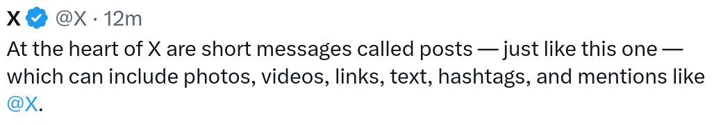

# SNN OCR
This project uses Spiking Neural Networks as part as an OCR application. The application works best with screenshots of text, such as snippets from Wikipedia but also works with scanned documents.
## Usage
Clone the repository and install the requirements.
```bash
git clone https://github.com/George-Ogden/SNN-OCR
cd SNN-OCR
sudo apt install imagemagick
pip install -r requirements.txt
```
### Download Weights
If you do not want to train your own models, download pretrained ones from https://github.com/George-Ogden/SNN-OCR/releases/tag/weights.
```bash
wget https://github.com/George-Ogden/SNN-OCR/releases/download/weights/checkpoints.zip
unzip checkpoints.zip
```
### Run the Application
```bash
python main.py [IMAGE_PATH]
```
And this prints the text in the image to the console.
#### Example
```bash
python main.py examples/post.png
```

```txt
Xe @X . 12m
I the bead Of X are show messages Called pasts -just like this One -
Which Can inClude photos, videos, links, text, hashtags, and mentions inke
@x.
```
## Training
### Additional Installation
You'll need the following additional libraries:
```bash
sudo apt install tesseract-ocr imagemagick
```
### Train the SNN
1. Generate a synthetic dataset
```bash
python train-snn/generate.py
```
2. Train the model
```bash
python train-snn/train.py
```
### Train the LSTM
1. Download subset of the C4 dataset
```bash
python train-lstm/download.py
```
2. Train the model
```bash
python train-lstm/train.py
```
